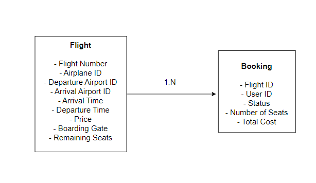
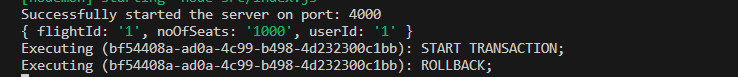
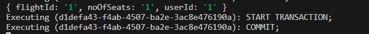
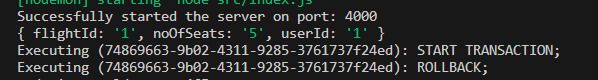
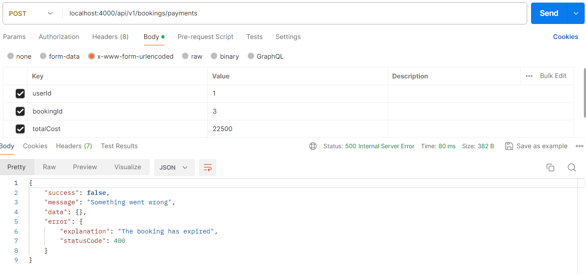

**Schema of Booking Service**



**High level flow of Booking Service**

The flow of this booking service is inspired by real life booking services like Flipkart Flights. When we initiate a booking like that on Flipkart Flights, it creates a temporary booking in the 'INITIATED' state. There's a timer of sometime (like 20 minutes or so), within which the payment must be done. If the payment service return a 200 (OK) response, then the booking service creates the required booking. Else if the session expires, then the booking transitions from 'INTIATED' state to 'TIMEDOUT' state.

When the user makes a POST call to initiate a booking, they'll be sending the payload in the format:

```
{
    flightId: 1,
    userId: 2,
    noOfSeats: 5
}
```

In order to validate whether the number of seats requested against the number of available seats, finding out the price per seat and updating the seats in case of a successful booking, we need to communicate with the Flights Search Service. Hence, we facilitate inter-service communication through REST API between the Bookings Service and Search Service.

We use row level locks in the Booking Service, so that a lock can be ensured on a particular record in the 'Flights' table. This ensures consistency of data in the table.

The entire logic to create a booking is atomic in nature, as we are leveraging the transactional capabilities provided by Sequelize. If the booking transaction fails at any point, the entire progress made so far is rolled back. The consistency of data is ensured by using the row based locks on the 'Flights' table, as discussed before.

For the scope of this project, we are not going to integrate a payment gateway. Instead, we are going to create a mock payments API. We expect the payment to be completed within 5 minutes from the time of the initiation of the booking. Else the booking will transition from INTIATED to CANCELLED state.

Some of the screenshots from this service are as follows:

1. The booking rolls back in case the required number of seats are not available: 




2. The booking commits in case the required number of seats are available:



3. The booking rolls back if the flight search service is not available:



4. The booking expires after the timeout is down:

